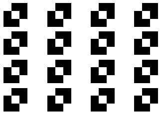

# KernelIdentity
> An initializer for Conv2D Keras layers.


This module was developed as part of another project involving perceptual metrics.

## Install

`pip install kernelidentity`

## How to use

A normal use case would involve instanciating a Keras `Conv2D` layer and setting `KernelIdentity` as the `kernel_initializer` parameter:

```python
import numpy as np
import matplotlib.pyplot as plt
import tensorflow as tf
from tensorflow.keras import layers
```

```python
layer = layers.Conv2D(filters=16, kernel_size=3, kernel_initializer=KernelIdentity())
layer.build(input_shape=(1,28,28,1))
```

And now we can check that all the filters are actually identity matrices:

```python
layer.get_weights()[0].shape
```


    (3, 3, 1, 16)


```python
plt.figure()

for i in range(16):
    kernel = layer.get_weights()[0][:,:,:,i].squeeze()
    plt.subplot(4,4,i+1)
    plt.matshow(kernel, 0, cmap='gray')
    plt.axis('off')

plt.show()    
```


    

    

